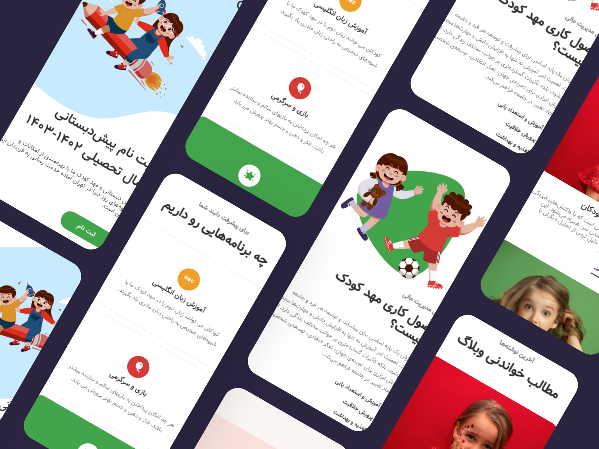
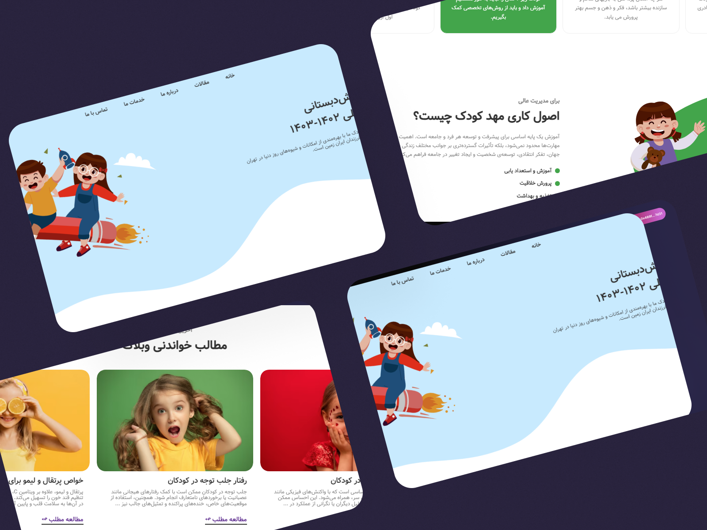

<h1 align="center">In the name of God</h1>

- **🌱 Beautiful Kindergarten :)**

-  **🆓 Free to the public**
 

**🛠️ Attributes:**
 
<ul>
  <li>A beautiful and eye-catching UI design, along with a pleasant responsive layout.</li>
  <li>Clean and easy to understand coding style.</li>
</ul> 

**⚒ Language & Tools:**
<ul>
  <li>HTML5</li>
  <li>CSS3</li>
  <li>JavaScript</li>
</ul>

**🖼️ Pictures:**
 
 

 

<h3 align="left">Connect with me:</h3>

    

 

Thank you for your beautiful look :) 🤍
  

* Designer : <a href="https://danialmahmoodi.ir/"><i>Danial Mahmoudi</i></a>

* Front-end developer : <a href="https://github.com/Hojjat-hk/"><i>Hojjat Hekmatipour</i></a>